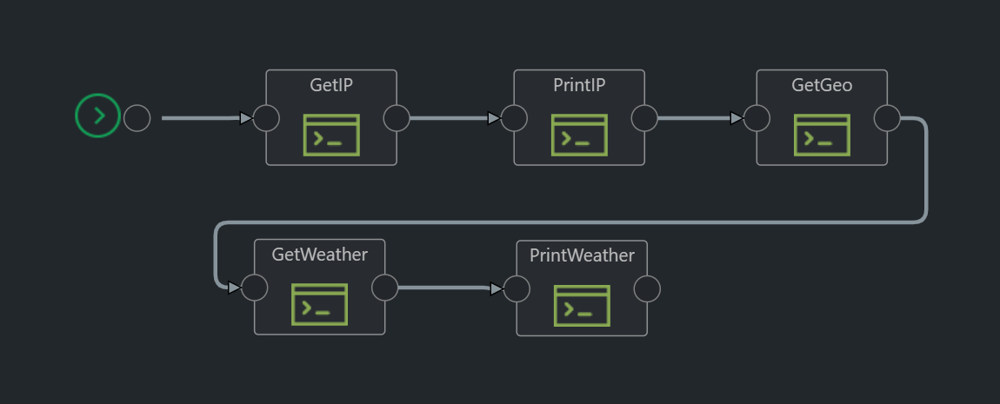

# Hello World: Part 1

## Intro

This simple pipeline consists of five actions that identifies IP address, get location data (latitude and longitude) based on IP and gets the current weather and city based on the location.

We will cover the following functionality:  

* pipeline configuration;  
* extracting secrets from the Vault;  
* pre-execution and post-execution functions;  
* passing data between actions;  

## Requirements

Create a free account in [Weatherbit.io](https://www.weatherbit.io/) to get weather data. Locate API key on the "API Keys / Admin" tab. We will need this key to make requests to weatherbit.io API.

## Plugins

The following Kaholo plugins used:  

* CommandLine

## Configuring the pipeline

Configuration and Vault

## Pre-execution and post-execution functions

TBD

## Passing data between actions

TBD
