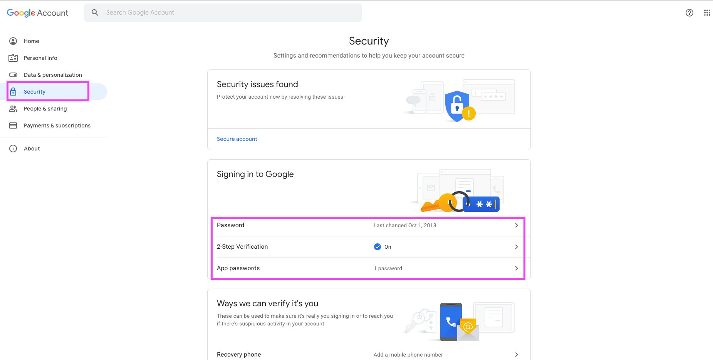
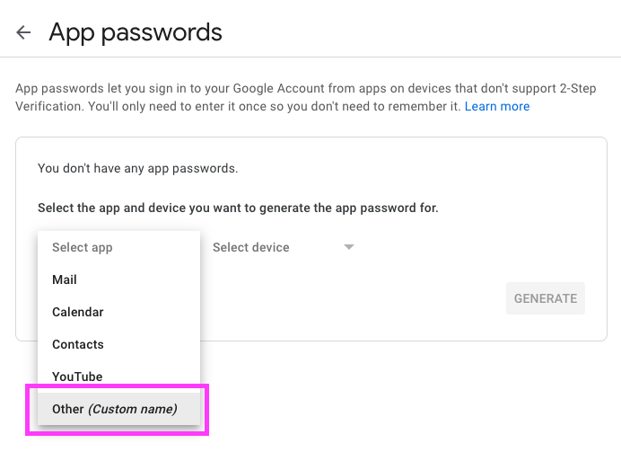
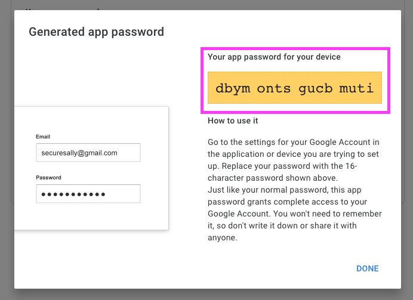

# Hello World: Part 2

## Intro

The pipeline consists of three actions that iteratively gets data from coinapi.io service for a specified list of coins, creates a simple HTML message and sends an email.

We will cover the following functionality:  

* loops;
* conditional code;

We are going to use Kaholo configurations, vault, pre-execution and post-executions functions. All these features are covered in [Hello World: Part 1](../hello_world_1/).

## Requirements

We are going to use Gmail account to send emails. For security reasons, user's Gmail password cannot be used. Also, we are not going to turn on the [Less Secure App Access](https://support.google.com/accounts/answer/6010255?hl=en) instead, we will enable 2-Step Verification and create an app password.

1. Navigate to [https://myaccount.google.com/](https://myaccount.google.com/) and open the `Security` tab. Then, enable `2-Step Verification` and click `App passwords`.  

2. In the dropdown menu, select `Other (Custom name)` option and name your application, for example `Crypto`.  

3. Paste somewhere the generated password (you will have a different password from the one you see on the screenshot). We are going to use this password in the pipeline.  

## Plugins

The following Kaholo plugins are used:  

* HTTP-Requests
* CommandLine
* SendMail

## Loops

Configuration and Vault

## Conditional code

TBD
