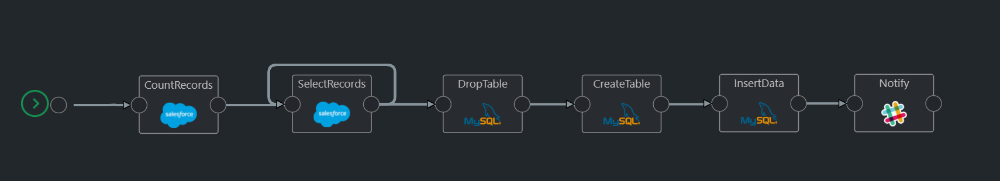

# Migrate Salesforce data to MySQL database

This template is for creating a pipeline that migrates data from Salesforce object to a MySQL database. A user specifies a Salesforce object and a list of fields to be migrated to the database. The pipeline queries data from specified Salesforce object, creates a table, transfroms and inserts data, sends a Slack notification.



## Requirements

1. Salesforce account
2. MySQL database
3. Slack account

## How the pipeline works

The pipeline consists of six actions that use custom JavaScript functions and values from `SF_MySQL_config` object:

1. `CountRecords`: retrieves the total number of records for a given Salesforce object.
2. `SelectRecords`: based on the total number of records, iteratively queries the Salesforce object and constructs an array of records.
3. `DropTable`: drops a table if it exists. Every time the pipeline runs, a table recreates.
4. `CreateTable`: creates an empty table based on `column_mapping` array from the configuration object.
5. `InsertData`: inserts data into the table.
6. `Notify`: sends a Slack notification (`Inserted <NUMBER_OF_ROWS> rows into "<TABLE_NAME>" table.`).

## Vault items

Create the following secrets:

- SALESFORCE_PASSWORD
- SALESFORCE_TOKEN
- SALESFORCE_USERNAME
- SALESFORCE_URL
- MYSQL_CONNECTION_STRING
- SLACK_INCOMING_WEBHOOK

**Important**: If you change secret names, you will need to update them in actions configuration.

## Pipeline configuration

1. `sf_object` - a Salesforce object.
2. `sf_limit` - the maximum number of Salesforce records to query in one request. It is 2000 by default. This is a hard limit of Salesforce. You can make it smaller, but not bigger.
3. `database` - a database name.
4. `table_name` - a table for storing data from a corresponding Salesforce object.
5. `column_mapping` - an array of objects that map Salesforce fields and table columns  
    5.1 `sf_object_field` - a Salesforce object field. It is `null` if there is no a corresponding column in a table.  
    5.2 `column_name` - a column name in a table.  
    5.3 `data_type` - a data type and constraints.  

Example:

```JSON
{
    "sf_object": "Account",
    "sf_limit": 2000,
    "database": "kaholo",
    "table_name": "account",
    "column_mapping": [
        {"sf_object_field": null, "column_name": "id", "data_type": "INT UNSIGNED AUTO_INCREMENT PRIMARY KEY"},
        {"sf_object_field": "Id", "column_name": "sf_id", "data_type": "VARCHAR(18) NOT NULL"},
        {"sf_object_field": "Name", "column_name": "name", "data_type": "VARCHAR(255) NOT NULL"},
        {"sf_object_field": "Phone", "column_name": "phone", "data_type": "VARCHAR(255)"}
    ]
}
```

## Plugins

1. Salesforce
2. MySQL
3. Slack

## Category

Data Engineering
